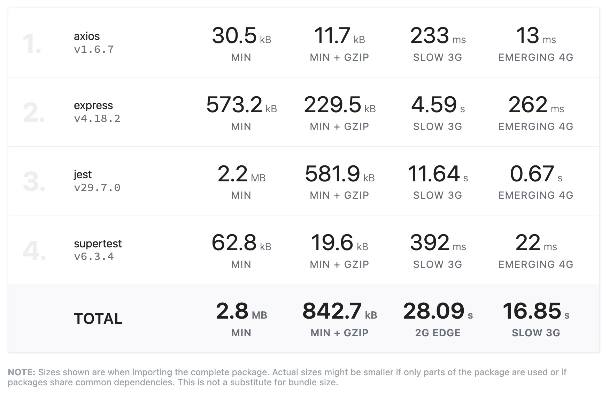

# SpaceX Launch Server

A Node.js server with a `single` endpoint that retrieves data from the SpaceX public API. The endpoint `/random-launch-image` returns a link to a random Flickr image associated with a SpaceX launch that has `at least one Flickr image` available.

## Table of Contents

- [SpaceX Launch Server](#spacex-launch-server)
  - [Table of Contents](#table-of-contents)
  - [SpaceX Launch Viewer](#spacex-launch-viewer)
  - [Installation](#installation)
  - [Usage](#usage)
  - [Endpoints](#endpoints)
    - [1. `/random-launch-image`](#1-random-launch-image)
      - [Example](#example)
  - [Testing](#testing)
  - [Bundle Size](#bundle-size)
  - [License](#license)

## SpaceX Launch Viewer

There is a React app that uses SpaceX API to display a random SpaceX launch image. You can find it [here](https://github.com/behnum/spacex-launch-viewer)

## Installation

Simply follow these steps:

1. Clone the repository:

    ```bash
    git clone https://github.com/behnum/spacex-launch-server.git
    ```

2. Change into the project directory:

    ```bash
    cd spacex-launch-server
    ```

3. Install dependencies:

    ```bash
    npm install
    ```

## Usage

To start the server, run the following command:

```bash
npm start
```

The server will be running at [http://localhost:3000](http://localhost:3000).

## Endpoints

### 1. `/random-launch-image`

- **Method**: GET
- **Description**: Returns a lin to a random Flickr image associated with a SpaceX launch.

#### Example

```bash
curl http://localhost:3000/random-launch-image
```

Response:

```json
{
"flickrImage": "https://live.staticflickr.com/65535/51004598206_9779f08338_o.jpg"
}
```

## Testing

This project uses Jest / Supertest for testing. To run the tests, use the following command:

```bash
npm test
```

## Bundle Size


Credits: [bundlephobia.com](https://bundlephobia.com)

## License

[MIT](https://choosealicense.com/licenses/mit/)
